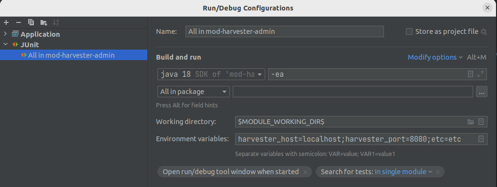
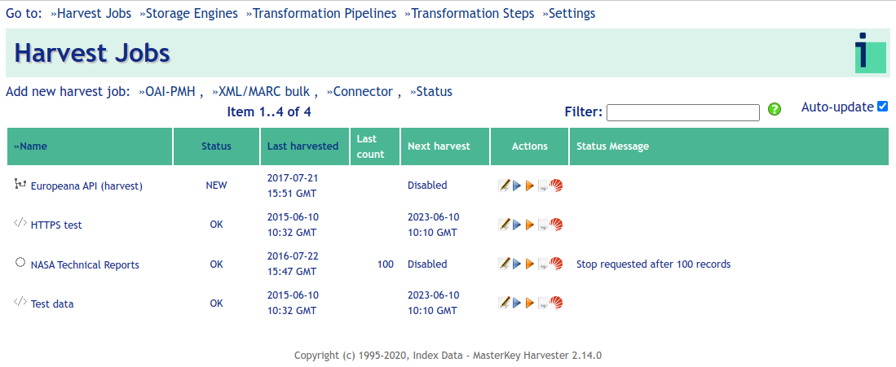

# Testing notes, mod-harvester-admin

The test suite currently depends on access to an installed Harvester (rather than relying on a mock-up of the legacy
Harvester API).

Due to this special requirement, unit testing is switched off by default in the POM. To run a `mvn install` with unit testing do

`mvn install -Dmaven.test.skip=false`

The Surefire plug-in configuration in the POM configures environment variables for a local Harvester, like host and port, to define the
access, similar to what would be defined in the module's deployment descriptor. However, an IDE running the JUnit tests
might not pick up the POM configurations, at least a current version of IntelliJ IDEA doesn't immediately do that. To
successfully run the test suite, say, from within IntelliJ IDEA, the environment variables can be set in the Run
Configuration.

## Install a local Harvester

Pre-requisites:

- Java JDK 1.8 (will not compile with later Java versions)
- Vagrant (ie 2.2.19)
- Port 8080 free

In a directory do:
`git clone https://github.com/indexdata/localindices`

`cd localindices`

`mvn clean install`

`vagrant up` (can take a while to install everything on first 'up')

`vagrant provision`

Test the installation by pointing browser to http://localhost:8080/harvester-admin, and it should display a UI similar
to this:

To bring the service down again, do `vagrant halt`. To restart, `vagrant up` and `vagrant provision`. To uninstall the
box, do `vagrant destroy`.
